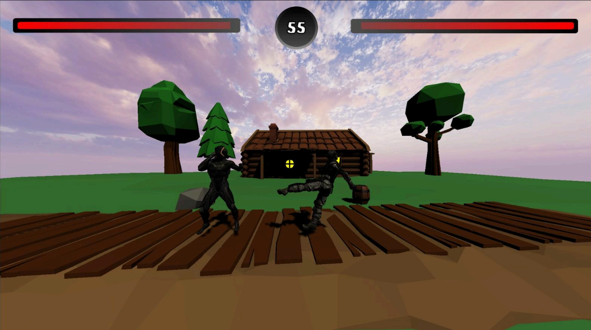
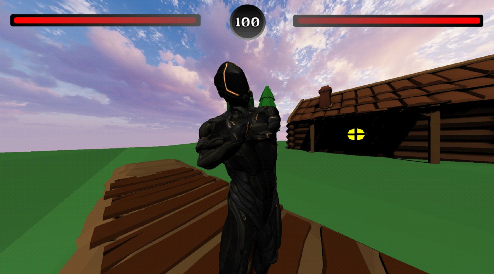
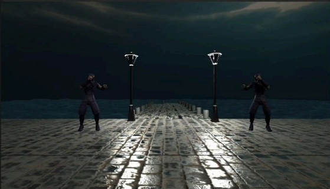
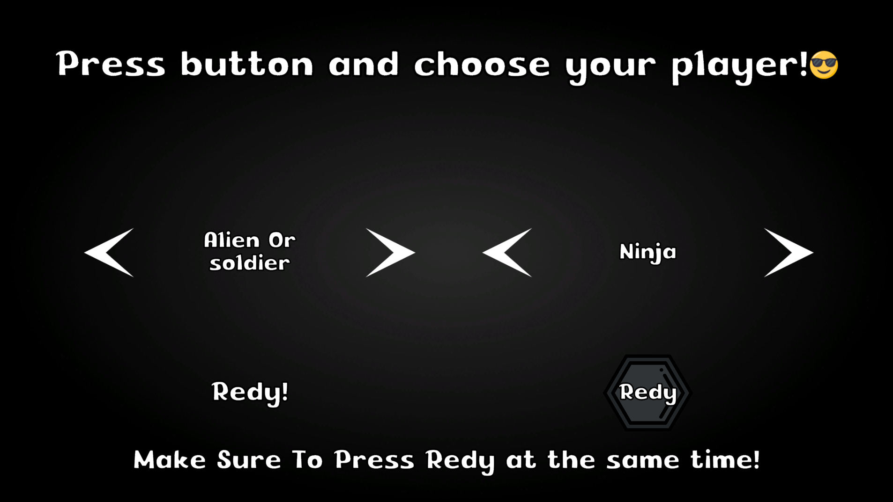
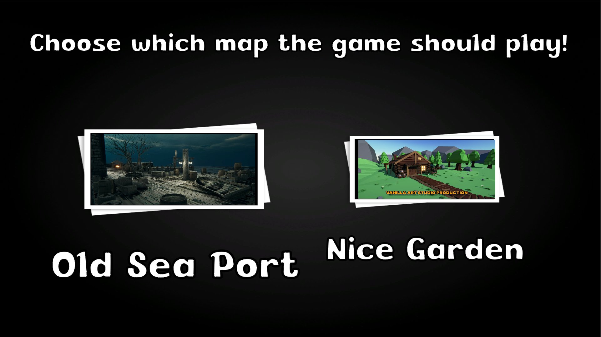
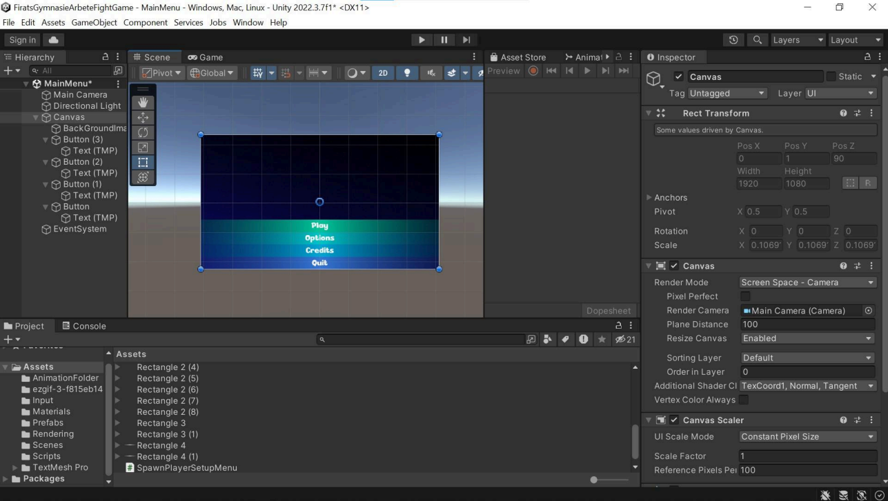
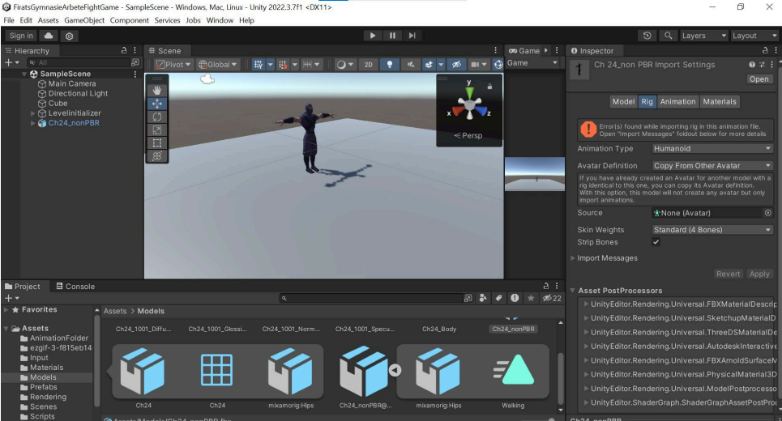
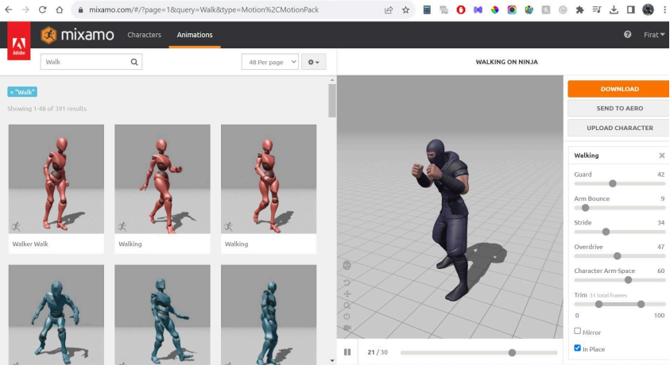
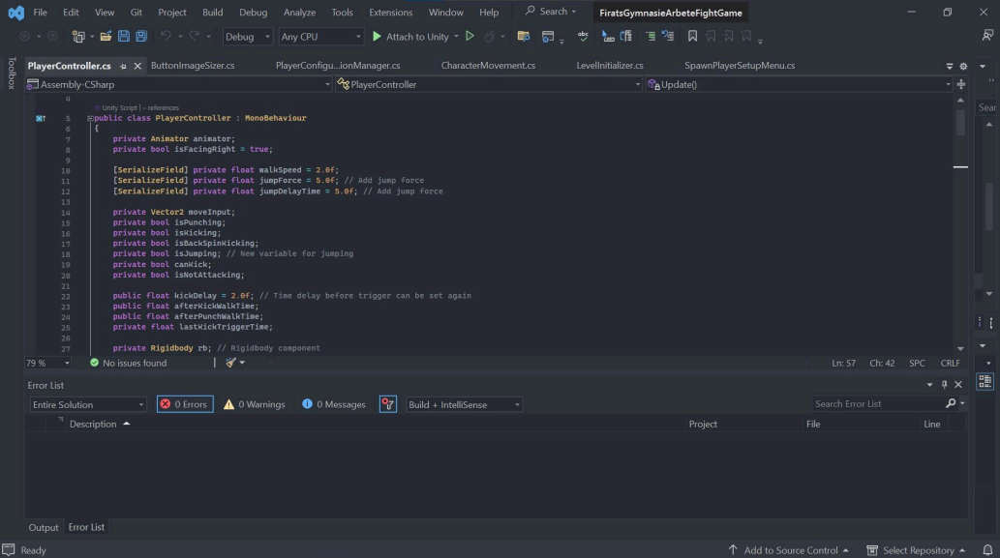

# Wacky Warriors

**A 2.5D local-multiplayer arena fighting game built in Unity and C#.**

---

## About the Project

Wacky Warriors is a head-to-head fighting game developed as my **Gymnasiearbete** (Swedish upper-secondary thesis project) at LBS Kreativa Gymnasiet. I worked on it for more than a year, covering gameplay programming, UI design and implementation, animation integration and level setup.

Two players pick a character and an arena, then fight until one health bar is empty or the round timer runs out.

## Features

- **2.5D combat** with punches, kicks and a back-spin kick, each with its own timing and cooldowns.
- **Multiple playable characters** (an alien/soldier and a ninja).
- **Multiple arenas**, including *Old Sea Port* and *Nice Garden*.
- **Local multiplayer** for two players on one machine.
- **Cross-input support** so players can mix input devices.
- **Custom animation system** built with Unity's Animator and Humanoid rigs.
- **Complete game flow:** main menu, character selection, map selection, and match HUD with health bars and a round timer.
- **UI designed in Figma** and implemented with TextMeshPro.

## Screenshots

### Gameplay

<table>
  <tr>
    <td width="50%"></td>
    <td width="50%"></td>
  </tr>
  <tr>
    <td align="center">Match HUD with health bars and round timer</td>
    <td align="center">Old Sea Port arena</td>
  </tr>
</table>

### Menus

<table>
  <tr>
    <td width="50%"></td>
    <td width="50%"></td>
  </tr>
  <tr>
    <td align="center">Character selection with ready-up for both players</td>
    <td align="center">Map selection</td>
  </tr>
</table>

## Development

### Unity setup and animation pipeline

<table>
  <tr>
    <td width="50%"></td>
    <td width="50%"></td>
  </tr>
  <tr>
    <td align="center">Main menu scene and UI canvas in the Unity editor</td>
    <td align="center">Humanoid rig setup for the character models</td>
  </tr>
</table>

Character animations such as walking and fighting stances were sourced from **Mixamo** and integrated through Unity's Animator.

  

### Gameplay code

Player behaviour lives in a `PlayerController` MonoBehaviour that handles movement, facing direction, jumping, and attack state (punching, kicking and back-spin kicking) together with cooldown timers. Other scripts handle level initialisation, player spawning and menu setup.

  

## Tech Stack

| Area | Technology |
| --- | --- |
| Engine | Unity 2022.3 |
| Language | C# |
| UI design | Figma, TextMeshPro |
| Animation | Unity Animator, Mixamo |
| IDE | Visual Studio |
| Rendering | Unity Universal Render Pipeline |

## What I Learned

- Structuring a larger Unity project with scenes, prefabs and scripts over a long development period.
- Building responsive character controls and managing combat state.
- Supporting several input devices in the same game.
- Taking a game from design in Figma through to a playable build.

## Credits

- Character animations from [Mixamo](https://www.mixamo.com).
- *Nice Garden* environment by Vanilla Art Studio.

## Author

**Firat Kaya**

- Portfolio: Firatportfolio.com
- GitHub: [@Firathubgit](https://github.com/Firathubgit)
- LinkedIn: [Firat Kaya](https://www.linkedin.com/in/firat-kaya-baba45267)
